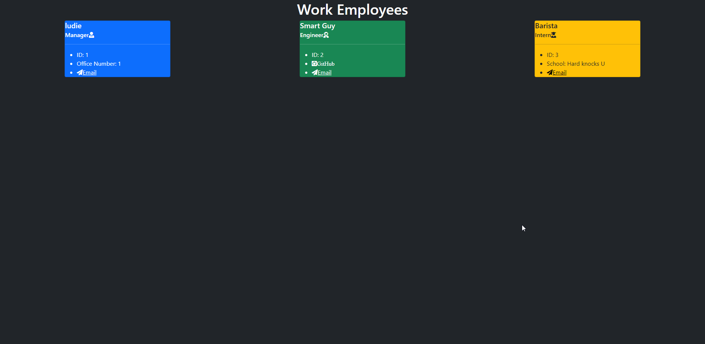

# Team-Profile-Generator

 <br> [MIT](https://opensource.org/licenses/MIT)

1.[ Description. ](#desc)
<br>
2.[ Installation. ](#inst)
<br>
3.[ Usage. ](#use)
<br>
4.[ Contributing. ](#contr)
<br>
5.[ Testing. ](#test)
<br>
6.[ Github. ](#git)
<br>
7.[ Contact Me.](#conta)
<br>

<a id="desc"></a>
## 1.Description

Team profile generator is a Node.js command-line application. It takes in information about employees on a software engineering team and then generates an HTML webpage that displays sumarries for each person. Technologies I used for this project were Javascript, Node, HTML.

<a id="inst"></a>
## 2.Installation

Clone the repository from github. Then run "npm i" inside the integrated terminal. Then run "npm i inquirer" inside the integrated terminal. Then type "node index" inside the terminal. This will present you with a prompt to enter the information and will then generate an html when finished.

<a id="use"></a>
## 3.Usage

OPEN USE

<a id="contr"></a>
## 4.Contributing

OPEN CONTRIBUTION

<a id="test"></a>
## 5.Testing
```

```
<a id="git"></a>
## 6.Github

[GitHub](https://github.com/veidul)

<a id="conta"></a>
## 7.Contact Me
Ludie Lambright
ludiefletcher@gmail.com



[Demo Video Link](https://youtu.be/3w11iGSWJm4)

